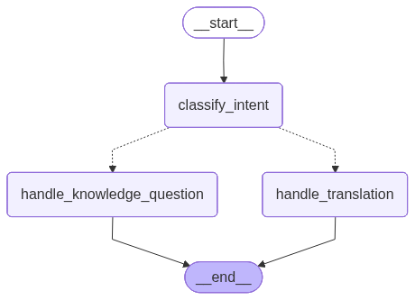

# SettleIn

Telegram bot that helps immigrants in Serbia navigate administrative procedures, understand documents, and overcome language barriers.

Built with Python, LangChain, LangGraph, and ChromaDB.

## What It Does

- **Knowledge Q&A** — ask questions about Serbian residency, work permits, banking, health insurance, tax registration, and daily procedures. Answers are sourced from a curated knowledge base using RAG (Retrieval-Augmented Generation)
- **Translation** — translate between Serbian and English in either direction
- **Smart routing** — a LangGraph orchestrator analyzes your intent and picks the right AI agent automatically
- **Input protection** — message validation, per-user rate limiting, and graceful error handling for LLM timeouts and API failures

## Architecture

```
User (Telegram app)
    │
    │ HTTPS (Telegram Bot API)
    ▼
Bot Handler Layer (handlers.py)
    │ validates input
    │ checks rate limit
    ▼
Orchestrator (orchestrator.py)
    │ classifies user intent
    │ routes to correct agent
    ├──────────────────────┐
    ▼                      ▼
RAG Agent              Translation Agent
(rag_agent.py)         (translation_agent.py)
    │                      │
    ▼                      │
ChromaDB                   │
(vector store)             │
    │                      │
    └──────────┬───────────┘
               ▼
        Response back to user via Telegram
```

### Orchestrator Graph

The orchestrator is built as a LangGraph StateGraph with intent-based routing:



## Project Structure

```
settle-in/
├── src/
│   ├── bot/
│   │   ├── app.py              # Bot entry point, webhook/polling startup
│   │   ├── handlers.py         # /start, /help, and message handlers
│   │   └── middleware.py       # Input validation and rate limiting
│   ├── agents/
│   │   ├── orchestrator.py     # LangGraph intent router
│   │   ├── rag_agent.py        # Knowledge retrieval chain
│   │   └── translation_agent.py
│   ├── knowledge/
│   │   ├── loader.py           # Document loading and text chunking
│   │   └── vectorstore.py      # ChromaDB setup and retriever
│   └── config.py               # Environment variable management
├── data/
│   └── knowledge_base/         # 8 text documents on Serbian procedures
├── tests/
│   ├── conftest.py             # Shared fixtures (mock Telegram, mock orchestrator)
│   ├── unit/                   # 42 unit tests
│   └── integration/            # 3 integration tests
├── Dockerfile
├── pyproject.toml
└── .env.example
```

## Tech Stack

| Component | Technology |
|-----------|-----------|
| Language | Python 3.11+ |
| Bot framework | python-telegram-bot 21+ |
| AI orchestration | LangChain + LangGraph |
| LLM | OpenAI GPT-4o-mini |
| Embeddings | OpenAI text-embedding-3-small |
| Vector store | ChromaDB |
| Testing | pytest, pytest-asyncio, pytest-cov |
| Linting | ruff |

## Quick Start

```bash
# Clone and enter the project
git clone https://github.com/yourusername/settle-in.git
cd settle-in

# Create virtual environment
python -m venv venv
venv\Scripts\activate        # Windows
# source venv/bin/activate   # Linux/Mac

# Install dependencies
pip install -e ".[dev]"

# Set up environment variables
cp .env.example .env
# Edit .env with your Telegram bot token and OpenAI API key

# Run the bot (polling mode for local development)
python -m src.bot.app
```

On first startup, the bot automatically builds the ChromaDB vector store from the knowledge base documents. This calls the OpenAI Embeddings API and takes about 10-20 seconds.

### Running with Docker

```bash
docker build -t settlein-bot .
docker run --env-file .env settlein-bot
```

## Deployment

The bot is deployed on [Railway](https://railway.app) using Docker with webhook mode.

### Environment Variables

| Variable | Required | Default | Description |
| -------- | -------- | ------- | ----------- |
| `TELEGRAM_BOT_TOKEN` | Yes | — | Bot token from BotFather |
| `OPENAI_API_KEY` | Yes | — | OpenAI API key for LLM and embeddings |
| `BOT_MODE` | No | `polling` | `polling` for local dev, `webhook` for production |
| `WEBHOOK_URL` | No | `""` | Public HTTPS URL for webhook mode |
| `PORT` | No | `8443` | Port for the webhook server |
| `CHROMA_PERSIST_DIR` | No | `./data/chroma_db` | Path where ChromaDB stores vector data |

### Polling vs Webhook

- **Polling** (local development): the bot asks Telegram "any new messages?" every few seconds. No public URL needed.
- **Webhook** (production): Telegram pushes messages to the bot's HTTPS endpoint. Faster and more efficient. Requires a public URL with TLS — Railway provides this automatically.

## Testing

45 tests (42 unit + 3 integration) at 73% code coverage.

```bash
# Run all tests
pytest tests/ -v

# Run with coverage report
pytest --cov=src tests/

# Run only unit tests
pytest tests/unit/ -v
```

**Unit tests** verify each function in isolation by mocking external dependencies (OpenAI API, Telegram API, ChromaDB). **Integration tests** verify that components work together — for example, that a user message flows correctly through the orchestrator to the right agent.
